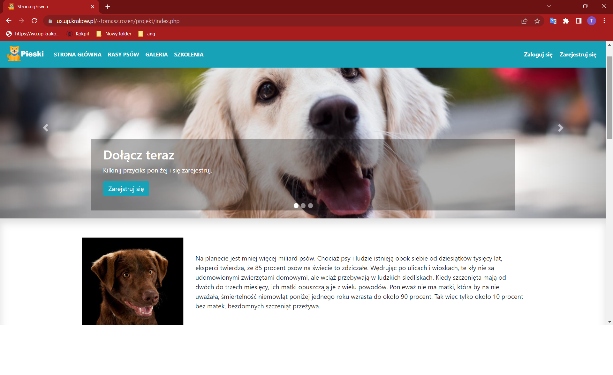

# website-project
HTML/CSS/BOOTSTRAP/PHP

Projekt strony internetowej
  
Użyte technologie: 
<b>HTML</b> 
<b>CSS</b> 
<b>PHP</b> 
<b>BOOTSTRAP</b> 
link do strony
https://ux.up.krakow.pl/~tomasz.rozen/projekt/index.php

